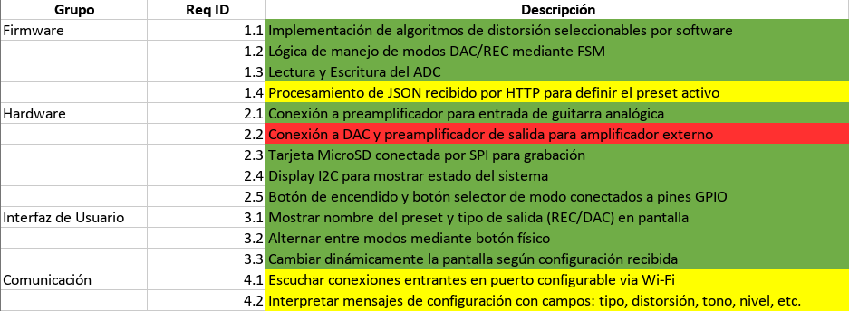

## Informe de Avance del Trabajo Final de 86.65 Sistemas Embebidos

#### Alumno - Lautaro De Lucia
#### Padrón - 100203
#### 1er Cuatrimestre 2025

En base a los requerimientos planteados en la definición del proyecto, se evalúa el estado actual de cada uno indicando en **verde** aquellos que ya fueron cumplidos, en **amarillo** aquellos que están en progreso y en **rojo** aquellos que se juzga no podrán ser cumplidos.

