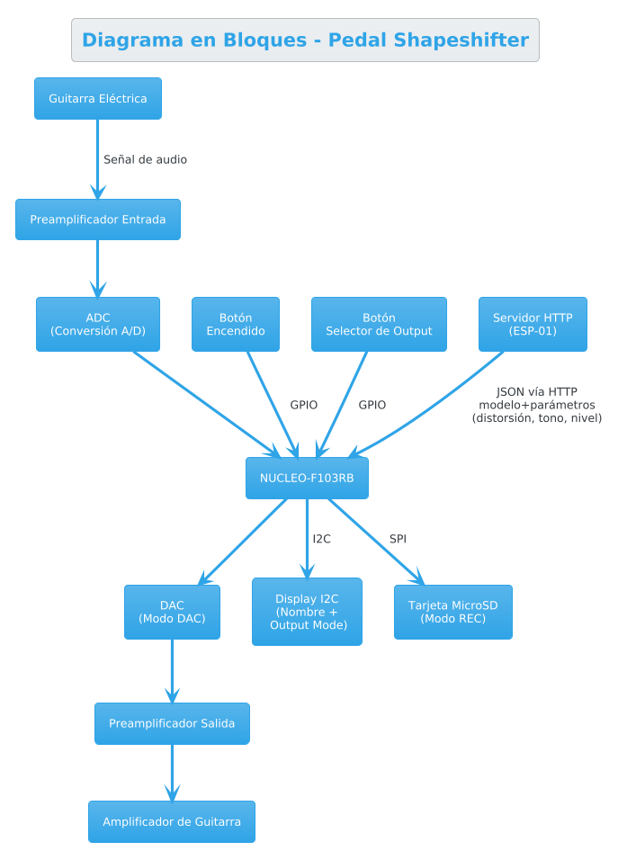

## Definición de Requisitos y Casos de Uso del Trabajo Final de 86.65 Sistemas Embebidos

#### Alumno - Lautaro De Lucia
#### Padrón - 100203
#### 1er Cuatrimestre 2025

## Selección del Proyecto

#### Objetivos 

Nuestro objetivo principal al encarar el Trabajo Final de la materia fue desarrollar un sistema que involucrara procesamiento de audio en tiempo real. Nos propusimos trabajar con señales analógicas provenientes de una guitarra eléctrica, procesarlas en un sistema embebido, y obtener una transformación o análisis de la misma. 

#### Propuestas Analizadas

Para cumplir con nuestro objetivo, se consideraron tres alternativas de proyecto:

- ***Afinador de guitarra***: un sistema embebido capaz de detectar la nota fundamental de una cuerda y mostrar en pantalla si la cuerda está afinada o no.

- ***Pedal de distorsión programable***: un pedal de efecto de distorsión configurable mediante software que permita emular digitalmente en un solo pedal muchos de los pedales de distorsión disponibles en el mercado.

- ***Pedalera multi-efectos***: un sistema más complejo que incorpora múltiples efectos (reverb, delay, distorsión, chorus, etc.) en una misma unidad, permitiendo la concatenación de los mismos. 

#### Comparación de las Propuestas

Para evaluar estas opciones se consideraron los siguientes criterios, asignando a cada uno un peso que refleja su importancia relativa para el proyecto:

| Criterio | Descripción | Peso | 
| --- | --- | --- |
| Disponibilidad del hardware | Facilidad para conseguir los módulos y componentes necesarios, tanto en términos de acceso como de costo | 10 |
| Tiempo estimado de implementación | Posibilidad de completar el proyecto dentro del plazo del cuatrimestre | 8 |
| Utilidad y valor educativo | Grado en el que el proyecto permite aplicar y consolidar conceptos clave del curso | 6 |
| Interés personal | Nivel de motivación del equipo con cada opción | 8 |
| Novedad de la Idea | Originalidad y potencial de innovación del proyecto | 6 |

La siguiente tabla resume la comparación y ponderación de las tres alternativas:

| Propuesta | Disponibilidad del hardware | Tiempo estimado de implementación | Utilidad y valor educativo | Interés personal | Novedad de la Idea | Puntaje Total |
| --- | --- | --- | --- | --- | --- | --- |
| Afinador de guitarra | 10(10) | 8(8) | 6(6) | 4(8) | 2(6) | 244 |
| Pedal de distorsión programable | 10(10) | 6(8) | 8(6) | 8(8) | 8(6) | 308 |
| Pedalera multi-efectos | 6(10) | 4(8) | 8(6) | 8(8) | 2(6) | 216 |

#### Descripción de la Propuesta Seleccionada

La propuesta seleccionada es el **Pedal de distorsión programable**, al cual en adelante denominaremos *Shapeshifter* siguiendo las convenciónes de nomenclatura de la industria de pedales de efectos. 

Nuestro objetivo es vencer las limitaciones de los pedales de distorsión analógicos, que suelen ofrecer un único tipo de distorsión, y permitir al usuario emular digitalmente una amplia variedad de pedales de distorsión populares en un solo dispositivo.

Así, el *Shapeshifter* tiene la forma de un pedal de efectos convencional. Pero a diferencia de este sus parámetros electroacústicos no se fijan por hardware ni por botones analógicos, sino que se reciben dinámicamente a través de una conexión HTTP, en forma de mensaje JSON enviado desde un servidor remoto o aplicación. 

El Sistema Embebido central es un microcontrolador NUCLEO-F103RB conectado a una guitarra por ADC (preamplificador mediante). El sistema cuenta con dos posibles salidas, seleccionables mediante un botón físico:
  - Modo DAC (Reproducción en tiempo real): el audio procesado se convierte nuevamente en analógico mediante el DAC y se envía a través de un preamplificador de salida hacia un amplificador de guitarra convencional. Esta configuración permite el uso del pedal en vivo como parte de una cadena de efectos.
  - Modo REC (Grabación): el audio procesado se guarda como archivo en una tarjeta microSD conectada mediante interfaz SPI. Esta función es útil para grabaciones rápidas, análisis posterior del tono o comparación entre presets.

El modelo actual que se esta emulando y el modo de salida se muestran en un display I2C. En suma, la interfaz de usuario física del pedal incluye un botón de encendido y un botón selector de modo de salida, y un display I2C que indica al usuario el modelo de distorsión actual y el modo de salida seleccionado.


El dispositivo utiliza un modulo WiFi ESP para conectarse a una red local y recibir mensajes HTTP. Estos mensajes definen la configuración de la distorsión que se esta emulando. Por ejemplo, un mensaje JSON podría tener la siguiente forma:

```json
{
  "model": "Boss DS-1",
  "gain": 0.7,
  "tone": 0.5,
  "level": 0.8,
  ... // otros parámetros específicos del modelo
}
```

Este mensaje define el modelo de distorsión a emular (en este caso, un Boss DS-1). El pedal ajusta sus parámetros internos para replicar el sonido de ese modelo específico. Siguientemente, el Display I2C va a mostrar `MODEL: Boss DS-1` indicando al usuario que el pedal esta emulando ese modelo de distorsión.




Presumiblemente exista una aplicación móvil o de escritorio que permita al usuario descargar distintos modelos de internet y seleccionar el modelo que quiere grabar en su pedal. El objetivo de este proyecto no es desarrollar esta aplicación, sino demostrar que ese tipo de infraestructura es perfectamente viable una vez que el hardware y el firmware del pedal estén implementados.

## Elicitación de Requisitos 


#### Análisis de Mercado 

El mercado de pedales de distorsión está dominado por dispositivos compactos, analógicos y con controles físicos. En este contexto, el Shapeshifter se diferencia como un pedal digital experimental, programable, capaz de alternar entre diferentes modos de operación y efectos en tiempo real.

A continuación se presenta una tabla comparativa entre el proyecto Shapeshifter y dos pedales de distorsión populares:

| Característica                      | BOSS DS-1                     | ProCo RAT 2                 | **Shapeshifter** (proyecto)    |
| ----------------------------------- | ----------------------------- | --------------------------- | ------------------------------ |
| Tipo de procesamiento               | Analógico                     | Analógico                   | **Digital**              |
| Tipo de distorsión                  | Clipping simétrico por diodos | Clipping op-amp + diodos    | **Seleccionable por software** |
| Controles físicos                   | Nivel, Tono, Distorsión       | Filtro, Distorsión, Volumen | 1 botón selector + JSON remoto |
| Configurable por software           | No                            | No                          | **Sí (HTTP JSON)**             |
| Capacidad de grabación (output REC) | No                            | No                          | **Sí (MicroSD)**               |
| Salida directa a amplificador       | Sí                            | Sí                          | **Sí (modo DAC)**              |
| Display informativo                 | No                            | No                          | **Sí (I2C)**                   |
| Precio estimado (USD)               | \~60                          | \~90                        | - \~60                        |

Esta comparativa evidencia que, si bien los pedales tradicionales ofrecen una experiencia inmediata y probada, el Shapeshifter introduce a un precio similar capacidades de interacción, automatización y grabación que no estan presentes en la competencia. 

#### Requisitos Funcionales

| **Grupo**           | **Req ID** | **Descripción**                                                                  |
| ------------------- | ---------- | -------------------------------------------------------------------------------- |
| Firmware            | 1.1        | Implementación de algoritmos de distorsión seleccionables por software.          |
|             | 1.2        | Lógica de manejo de modos DAC/REC mediante FSM.                                  |
|             | 1.3        | Lectura del ADC, escritura del DAC.         |
|             | 1.4        | Procesamiento de JSON recibido por HTTP para definir el preset activo           |
| Hardware            | 2.1        | Conexión a preamplificador para entrada de guitarra analógica                   |
|             | 2.2        | Conexión a DAC y preamplificador de salida para amplificador externo            |
|             | 2.3        | Tarjeta MicroSD conectada por SPI para grabación                                |
|             | 2.4        | Display I2C para mostrar estado del sistema                                     |
|             | 2.5        | Botón de encendido y botón selector de modo conectados a pines GPIO             |
| Interfaz de usuario | 3.1        | Mostrar nombre del preset y tipo de salida (REC/DAC) en pantalla.                |
|  | 3.2        | Alternar entre modos mediante botón físico.                                      |
|  | 3.3        | Cambiar dinámicamente la pantalla según configuración recibida.                  |
| Comunicación        | 4.1        | Escuchar conexiones entrantes en puerto configurable vía Wi-Fi o Ethernet.       |
|         | 4.2        | Interpretar mensajes de configuración con campos: tipo, distorsión, tono, nivel, etc. |


## Casos de Uso

| Elemento         | Definición                                                                        |
| ---------------- | --------------------------------------------------------------------------------- |
| **Disparador**   | El usuario presiona el botón selector de modo.                                    |
| **Precondición** | El sistema está encendido y listo.                                                |
| **Flujo básico** | El sistema cambia entre modo DAC y REC, actualiza la pantalla y ajusta la salida. |


| Elemento         | Definición                                                                              |
| ---------------- | --------------------------------------------------------------------------------------- |
| **Disparador**   | Se recibe un JSON de configuración válido por HTTP.                                     |
| **Precondición** | El sistema está conectado a la red.                                                     |
| **Flujo básico** | El sistema parsea los parámetros, aplica la configuración y actualiza el preset activo. |


| Elemento         | Definición                                                 |
| ---------------- | ---------------------------------------------------------- |
| **Disparador**   | El sistema detecta señal de guitarra en modo REC.          |
| **Precondición** | La tarjeta MicroSD está correctamente insertada.           |
| **Flujo básico** | La señal procesada se graba como archivo en la tarjeta SD. |
