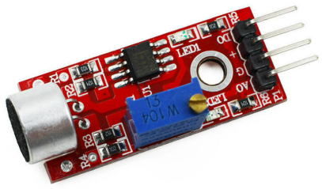
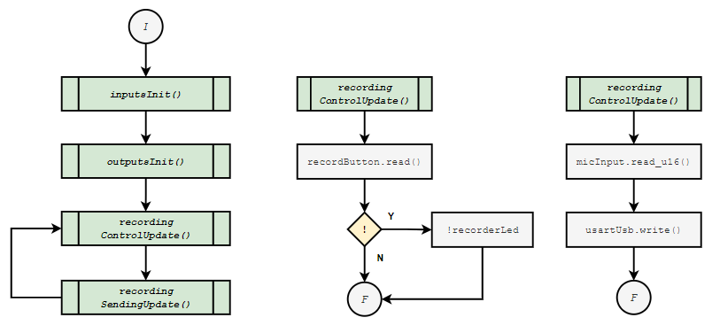
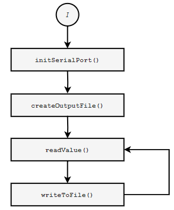
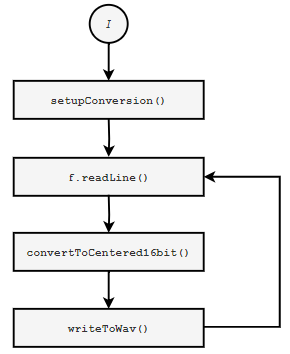
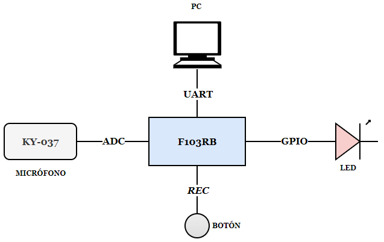
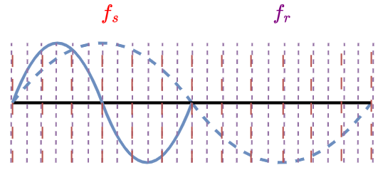

# TP1 - Grabador de Audio

## Alumno : Lautaro De Lucia
## Materia : Sistemas Embebidos 

## Objetivo 

Capturar audio con la **NUCLEO-F103RB**.

## Descripción

Al iniciar, el programa queda en espera hasta que el usuario presione un botón. Al presionarlo, inicia la grabación del audio, el cual proveniene de un módulo KY-037 conectado al ADC del microcontrolador. Las lecturas de la señal de audio se transmiten a la PC mediante UART. La grabación puede detenerse manualmente volviendo a pulsar el botón. Los estados del sistema se indican visualmente mediante un LED.

## Especificaciones

- **Microcontrolador**: STM32F103RB (ARM Cortex-M3).
- **Entrada Analógica:** Sensor de audio KY-037 conectado al canal analógico A0, alimentado con 3,3V de la placa.
- **Frecuencia de muestreo:** Por simplicidad, se utilizará una frecuencia de muestreo de 8 kHz.
- **Baudrate UART:** 230400 bps.
 

| Periférico           | Uso en el sistema                           | Pin utilizado    |
|----------------------|--------------------------------------------|------------------|
| KY-037 Analog Out    | Captura de audio analógico                  | PA0            |
| REC_BUTTON          | Inicia/detiene la grabación                 | BUTTON1  |
| LED (grabando)       | Encendido indica grabación activa           | LED1   |

## Consideraciones Técnicas y Limitaciones

#### Hardware 

El uso de un módulo tan límitado como el $KY-037$ responde a la su bajo costo y su simplicidad de integración con la NUCLEO. El objetivo en este TP es evaluar la posibilidad de capturar audio mediante el ADC del dispositivo, ***no*** implementar un grabador de alta fidelidad. Esto último implicaría un hardware más costoso y probablemente la necesidad de diseñar una etapa preamplificadora propia para el micrófono, lo cual excede con creces los objetivos de este trabajo práctico.

#### Sampling

Similarmente, como el objetivo de este Trabajo Práctico es aplicar los conocimientos correspondientes a las primeras 3 unidades de la materia, se optó por utilizar delays simples para el sampling. Así, se utiliza la función `wait_us()` de Mbed para un período de muestreo $T=125us$ correspondiente a $f_s=8kHz$. Presumiblemente, trabajar con delays de microsegundos no resulte eficiente y sea más conveniente configurar el timer del microcontrolador para que genere interrupciones a la frecuencia deseada. Esto excede el temario a la fecha y por ende se prefiere limitar la implementación a delays simples. Por otro lado, no sería correcto reducir la frecuencia de muestreo a un valor incluso menor a $8kHz$, lo que destruiría cualquier fidelidad en la captura de audio (dado el teorema de Nyquist). En suma, esta claro que esta es una implementación ineficiente que solo sirve como borrador para una posterior implementación más robusta que delegue el muestreo a un timer.

#### Baudrate

Siendo la resolución del ADC de $12 \ bits$, cada muestra involucra $2\ bytes$. Luego, dado que se muestrea a $8 kHz$, el flujo de datos ronda los $16 000 \frac{byte}{s}$. Estos son $128 000 bps$ tan solo para el flujo de datos, a los cual debemos agregar el overhead de la comunicación UART. El baudrate seleccionado de $230 400 bps$ nos otorga un rango cómodo para transmitir los datos sin riesgo de saturación al tiempo que es perfectamente manejable para la NUCLEO-F103RB.

## Flujo

A continuación se resume el flujo de la aplicación en forma de diagramas para cada script de la aplicación. La captura de audio necesariamente involucra un script externo de python que se encarga de recibir los datos por UART y convertirlos a un archivo audible `.wav`. Todos los scripts se adjuntan en este repositorio.

#### main.cpp

#### main.py

#### text_to_wav.py

## Diagrama de Bloques

## Conclusiones

Como puede observarse en los [videos](./video-0.mp4) adjuntos en este repositorio, los resultados son mixtos. Si bién efectivamente logra grabarse y transmitirse la señal de audio, se presentan dos problemas principales.  

- ***Baja Calidad de Audio***: Creemos que esto se debe principalmente a 3 factores:
  - ***Limitaciones de hardware***: El KY-037 es un módulo de bajo costo y calidad, lo que afecta la fidelidad de la grabación.
  - ***Limitaciones en la Frecuencia de Muestreo***: La frecuencia de muestreo de 8 kHz implica un ancho de banda de 4 kHz en la señal reconstruida, lo cual resulta deficiente si el objetivo es capturar audio fidelignamente.
  - ***Limitaciones en la Captura***: Es probable que la suma de una resolución de 12-bits, el márgen de error en la captura y el bajo rango de valores (La señal se centra en 1,65V y dificilmente extiende el rango pico-pico más allá de 1V) contribuyan a la baja fidelidad de la señal.

- ***Insuficiente Precisión en el Muestreo***: Como corroboramos en el video, la señal resultante es más corta y presenta un mayor pitch, lo cual es un claro síntoma de que la frecuencia de reconstrucción es mayor que la frecuencia de muestreo efectiva.

Como hipotetizamos en la sección sobre limitaciones técnicas, lo más probable es que esto se deba a que utilizar delays de microsegundos no es una forma eficiente de muestrar, dado que la propia ejecución del código en cada loop puede conllevar un *overhead* de varios microsegundos. Presumiblemente, configurar un timer para que genere interrupciones a la frecuencia deseada solucionaría este problema. Si esto a su vez permite una frecuencia de muestreo de 16Hz y utilizamos un mejor hardware, habría una mejora considerable en la calidad del audio resultante.