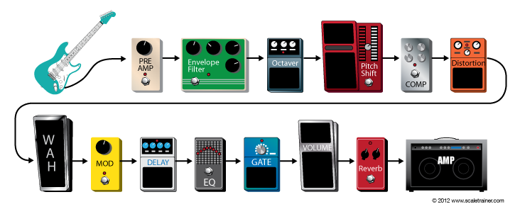
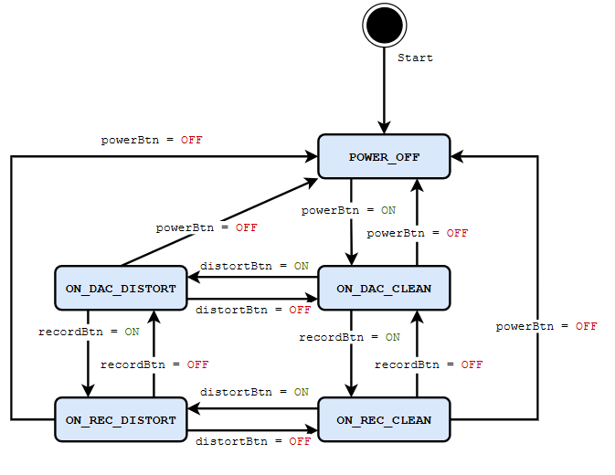
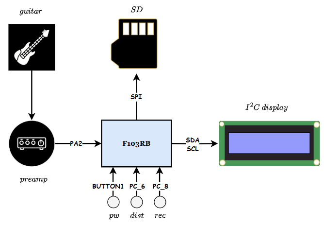
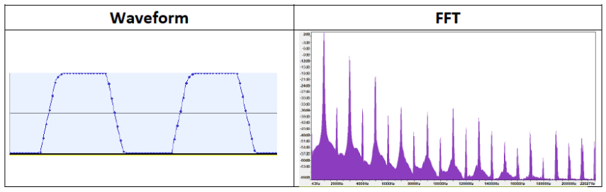
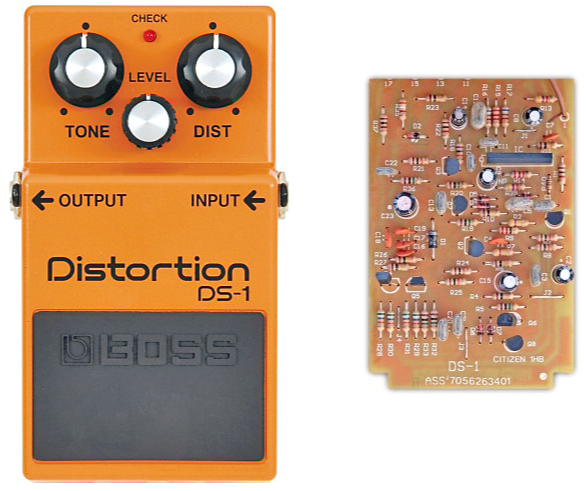
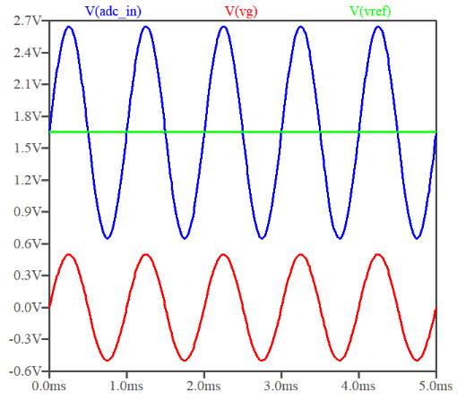
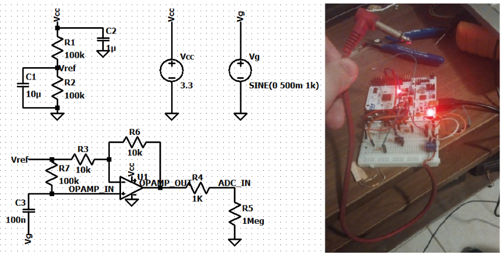

# TP2 - Pedal de Efectos

### Alumno : Lautaro De Lucia
### Materia : Sistemas Embebidos 
### Fecha: 03/05/2025


## Objetivo 

Evaluar la posibilidad de implementar un pedal de efectos de guitarra en la **NUCLEO-F103RB**.

## Descripción

Un pedal de efectos es un sistema que transforma una señal incidente en una señal de salida alterada en alguna forma agradable al oído humano. Estos efectos suelen colocarse en cascada, pudiendo encender y apagar cada uno de ellos de forma independiente. 

<center>



</center>

Si bien estos efectos suelen ser analógicos, la mayoría de ellos puede emularse digitalmente con poca dificultad, por lo que resulta verosímil implementar un pedal de efectos digital en un microcontrolador que disponga de un ADC, como lo es el caso de la NUCLEO-F103RB. 

En nuestro caso, se decidió implementar un pedal de ***distorsión***. La idea era poder seleccionar entre sonido limpio y distorsionado, al tiempo que también se puede seleccionar si la salida resultante se transmite por medio del DAC del dispositivo o se envía a un puerto UART para su posterior procesamiento. Esto deriva en el siguiente diagrama de estados implementado como una FSM en el código.

<center>



</center>

Donde se ve claramente que el control involucra tres botones, uno para encender y apagar el pedal, otro para seleccionar entre sonido limpio y distorsionado y un tercero para seleccionar entre salida por UART o DAC. 

Los detalles electroacústicos de el pedal de distorsión así como el diseño de la etapa de preamplificación necesaria para conectar una guitarra al dispositivo se encuentran en respectivos anexos al final de este README.

## Diseño

Con el fin de obtener código apropiadamente modularizado, con bajo acoplamiento y alta cohesión, se opto por un diseño orientado a objetos. A continuación, se presenta un diagrama de clases global del proyecto una breve descripción de la responsabilidad de cada clase. 

<center>


</center>


- ***PedalFSM***: Esta clase encapsula la máquina de estados del pedal. Se encarga de gestionar el estado actual del pedal y de realizar las transiciones entre los diferentes estados.
- ***InputHandler***: Maneja la comunicación con los distintos inputs del pedal, en este caso los 3 botones mencionados arriba. Define los 3 botones como instancias de una clase ***DebounceButton***, esto es, una clase que implementa un debounce de hardware para evitar lecturas erróneas.
- ***StatusController***: Maneja la comunicación de estados por medio de LEDs. En este caso la mayor parte de su funcionalidad fue sustituida por el uso del Display I2C, quedando solo el LED de encendido (inicialmente los estados de informaban por medio de LEDs). 
- ***DisplayController***: Este controlador se encarga de manejar la comunicación con el display I2C. Se vale de una clase I2CDisplay que es a si mismo un wrapper sobre la librería `display` utilizada por la cátedra. 
- ***AudioController***: Maneja el procesamiento de las muestras de audio. Involucra todo lo referente a la captura de audio, el procesamiento del mismo y el output de la señal procesada. 

Este esquema genérico puede adaptarse a cualquier pedal de efectos que quisiesemos implementar, sea este de distorsión, delay, chorus, etc. La acumulación de efectos en cascada es un poco más compleja, pero no involucraría cambiar el diseño tanto como extenderlo para permitir múltiples máquinas de estados y controladores, cada uno de los cuales podría ser un efecto diferente. 

## Flujo 

Aunque el diagrama de clases pueda parecer complejo, es fácil comprobar que el rol de la mayoría de las clases es el de ser una mera interface que facilite la comunicación entre el programador y el hardware. Una vez definida esta abstracción apropiada para los elementos claves de la comunicación, el flujo del programa es bastante sencillo de representar, y lo resumimos en los dos diagramas que se muestran a continuación. 

<center>


</center>

En el primero observamos el flujo principal del programa. Luego de leer el estado de los botones, se actualiza la FSM, y el nuevo estado informa a los controladores cómo deben ajustar su comportamiento. La captura de audio se realiza por medio de un ***Ticker*** que se encarga de llamar a la función de captura de audio cada vez que el timer llega a su valor máximo. 

En el segundo, vemos como el controlador de audio maneja esta captura, seleccionando distorsionarla o no y enviarla por UART o DAC según el estado de la FSM que se le fue informado en el bucle principal. 


## Especificaciones

- **Microcontrolador**: STM32F103RB (ARM Cortex-M3).
- **Entrada Analógica**: Señal de Audio de la guitarra preamplificada para centrarse en 1.65V y tener una excursión que no exceda los límites del ADC. 
- **Frecuencia de muestreo:** Por simplicidad, se utilizó una frecuencia de muestreo de 8 kHz.
- **Baudrate UART:** 230400 bps.
 

| Periférico           | Uso en el sistema                           | Pin utilizado    |
|----------------------|--------------------------------------------|------------------|
| Output Preamplificador   | Captura de audio analógico                  | PA2           |
| PowerBtn          | Enciende/Apaga el Pedal                 | BUTTON1  |
| recordBtn         | Cambia entre grabación y reproducción     | PC_6  |
| distBtn          | Cambia entre distorsión y sonido limpio   | PC_8  |
| SDA I2C | Comunicación I2C | D14/SDA   |
| SCL I2C | Comunicación I2C | D15/SCL   |

## Diagrama de Bloques

<center>



</center>

## Conclusiones

- El pedal de efectos fue implementado con éxito en la NUCLEO-F103RB, las pistas de audio y el video de demostración se adjuntan en este repositorio. Como se oye, la calidad del audio no es la mejor, sobre todo para el tono limpio. Se juzga que esto se debe a una deficiencia en el valor absoluto de la amplificación, la cual fue conservadora tanto en términos de ganancia como en asumir un $V_{pp}$ alto para la señal de la guitarra (ver Anexo). La baja amplitud resultante se vuelve entonces comparable al ruido propio de el dispositivo y los componentes utilizados, haciendo que la señal limpia suene ruidosa. La señal distorsionada, por otro lado, resulta mucho más agradable al oido y es consistente con las características acústicas descritas en el Anexo. 

- A esto debemos agregarle las limitaciones propias de el dispositivo, las cuales involucran una frecuencia de muestreo que no puede exceder los 8kHz (una frecuencia de 16kHz podría involucrar una perdida de datos tanto por exigir un baudrate que el dispositivo no puede proporcionar así como el hecho de que el bucle principal puede tardar más que los microsegundos correspondientes a la interrupción del timer). La resolución del ADC en 12 bits es decente pero podría ser incluso mayor, las capturas pueden tener un márgen de error considerable y el rango de 0 a 3.3V impone sus propios problemas, dado que la mayoría de los amplificadores operacionales operan con tensiones mayores. 

- En suma, concluimos que ***el dispositivo es perfectamente capaz de captar y procesar audio***, pero ***no resulta idoneo*** para fines acústicos. Es probable, por lo tanto, que eligamos modificar nuestro proyecto en la próxima entrega, reutilizando los módulos de audio definidos en este proyecto para grabar audio de forma fideligna e incluso hacer algo de pre-procesamiento del mismo, pero descartando utilizar el dispositivo para fines acústicos. 


## Anexo 1 - Emulación por Software del Efecto de Distorsión

El efecto de distorsión amplifica y recorta deliberadamente la señal de audio (hard clipping), brindando un sonido agresivo y saturado a la salida. 

<center>



</center>


Un pedal de distorsión presenta como mínimo 3 controles.

- ***Distorsión***: Grado de clipping de la señal.
- ***Tono***: Grado de énfasis de frecuencias altas.
- ***Nivel***: Volumen de la señal de salida.

<center>



</center>

Tanto el control de nivel como el clipping son triviales de implementar en software bajo cualquier contexto. El control de tono, en cambio, es un poco más complicado. Dadas las limitaciones del dispositivo, no resulta verosímil utilizar bibliotecas externas de procesamiento de audio. Luego, decidimos implementar el control de tono mediante filtros IIR de primer orden. Partimos de un pasa-bajos de ecuación $y[n]=\alpha x[n] + (1-\alpha)y[n-1]$, donde $x[n]$ es la señal de entrada, $y[n-1]$ es el output previamente filtrado y $\alpha$ controla el corte del filtro. Para obtener un pasa-altos, restamos el output del pasa-bajos la input (cancelamos el componente de baja frecuencia y preservamos las altas frecuencias). Finalmente, mezclamos ambas señales con un factor de mezcla $T$ que controla el grado de énfasis de cada filtro. 


```CPP

    uint16_t rawAdcValue = micInput.read_u16() >> 4;  // 12-bit [0..4095]
    int16_t sample = rawAdcValue - 2048;              // [-2048..2047]

    // Preamplificación
    float gain = 4.0f;  
    float amplified = sample * gain;

    // Hard clipping
    float clipThreshold = 400.0f; 
    if (amplified > clipThreshold) {
        amplified = clipThreshold;
    } else if (amplified < -clipThreshold) {
        amplified = -clipThreshold;
    }

    // Frecuencia de corte dada por el alpha del filtro IIR de 1er Orden
    // Tono ~> 1 = 100% Pasa Altos, 0 = 100% Pasa Bajos
    float alpha = 0.5f;
    float tone = 0.5f;

    // Aplicamos los dos filtros
    static float lpFiltered = 0.0f;
    lpFiltered = alpha * amplified + (1.0f - alpha) * lpFiltered;
    float hpFiltered = amplified - lpFiltered;

    // Mezcla
    float toneOutput = (1.0f - tone) * lpFiltered + (tone) * hpFiltered;

    // Volvemos a centrar en ~1.65V
    int16_t finalSample = (int16_t)(toneOutput + 2048.0f);


```


## Anexo 2 - Preamplificación para conectar una Guitarra al Dispositivo

Ordinariamente, la señal de una guitarra eléctrica no excede un $V_{pp}$ de $1V$. Esto es, si conectasemos la guitarra directamente a un osciloscopio la señal estaría centrada en $GND$ y no excedería una amplitud de $0.5 V$. Dado el rango del ADC de $0$ a $3.3V$, se volvió necesario diseñar una etapa preamplificadora que por un lado eleve la señal de la guitarra centrandola en $1.65 V$ y al mismo tiempo la amplifique con una ganancia conservadora de entre $2$ y $3$.

<center>



</center>


Para esto, el amplificador operacional $MCP6001$ resulto ideal, dado su bajo consumo y alta fidelidad. A continuación, se muestra el esquemático y la implementación. Se observa que estamos utilizando un divisor resistivo para polarizar $V_{in}$ a 1.65V y el amplificador en configuración no inversora con una ganancia $A_v=1+\frac{R_f}{R_1}\approx 2$. Los componentes se eligieron en función de su disponibilidad, aunque el alto valor de los resistores es una elección deliberada para limitar la corriente (ya que la nucleo puede proporcionar un máximo de 300mA y $A2$ no es el único puerto que consume corriente).

<center>



</center>